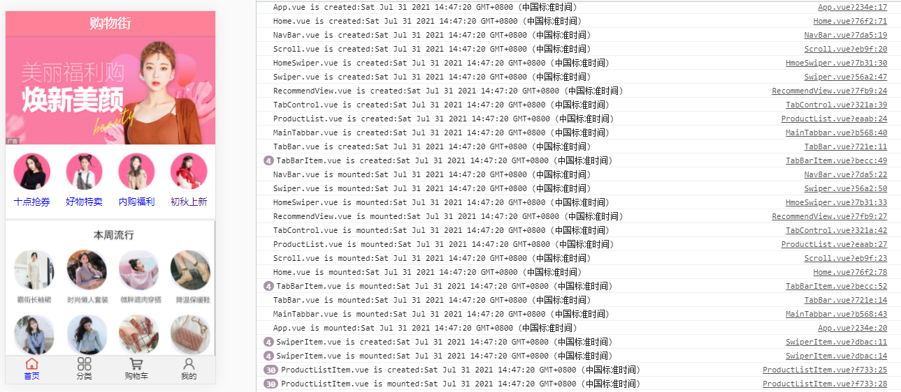
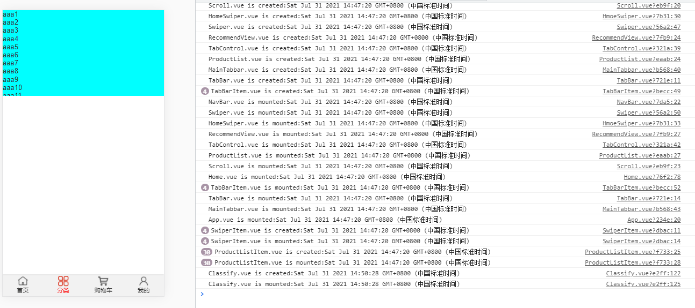

# 描述 -- devPhone6分支
该分支(devPhone5之后), 此分支是用来测试的分支, 因为我的代码按照老师的来总是有点小bug, 所以我就想看看到底整个界面的加载流程到底是怎么样的
 
如图:

 
点击分类后,如图:

 
学会了:

1. vue的created事件执行时, 是从外到内(App.vue --> home.vue), 进入到主要显示区域(home.vue)后是按照内容从上到下, 内容也是从最外层组件向里面进行created操作
2. vue的mounted事件则是, 从内容最里层向外执行mounted, 主要显示区域的内容从上到下, , 等主要页面内容全部mounted后, 再来对主要界面进行mounted, 最后对App.vue进行mounted
3. 有网络请求的(通过.getTime()测试), 获得请求得结果后, 才会同时进行created和mounted, 数据请求一般在App.vue执行mounted之后才会发生, 也可能是我的项目比较小, 所以才出现这种效果
4. 使用vue-router, 切换tabbar会卸载其它界面, 导致再次进入页面时刷新; 未点击的界面不会提前加载

 

这里scroll的bug, 视频后面会讲, 大致就是batter-scroll会在图片没有完全显示的时候,就计算出高度,甚至可能没有请求就计算了高度, 所以会出现老是不能滚动的bug, 视频的方式是监听图片加载完成事件

swiper应该也是这样, 因为网络请求是在home.vue中写的, 但是网络请求一般在App.vue执行完mounted事件后才会请求, swiper在home之前就开始运行了, 所以根本没有元素进行滚动.

## 开发注意事项
1. 记得删除.git文件,以免无法和自己的库连接
2. .editorconfig文件如果不需要请删除
3. 里面的四个css规范化,是非常友好的,而且引用顺序也是我排好的,不建议修改顺序,代码有不合适自己的可以修改并保存为自己的哟!
4. 使用时想看到图中效果, 应该删除.getTime() , .getTime()是为了查看request请求和ProductListItem.vue还有swiper.vue的顺序关系

## 注意
a.txt文件是为了能上传到github才创建的,里面是介绍文件夹应该放什么东西

老师视频:https://www.bilibili.com/video/BV15741177Eh?p=168&spm_id_from=pageDriver

tabControl每次点击都会重新加载, 感觉今后视频也会解决的

